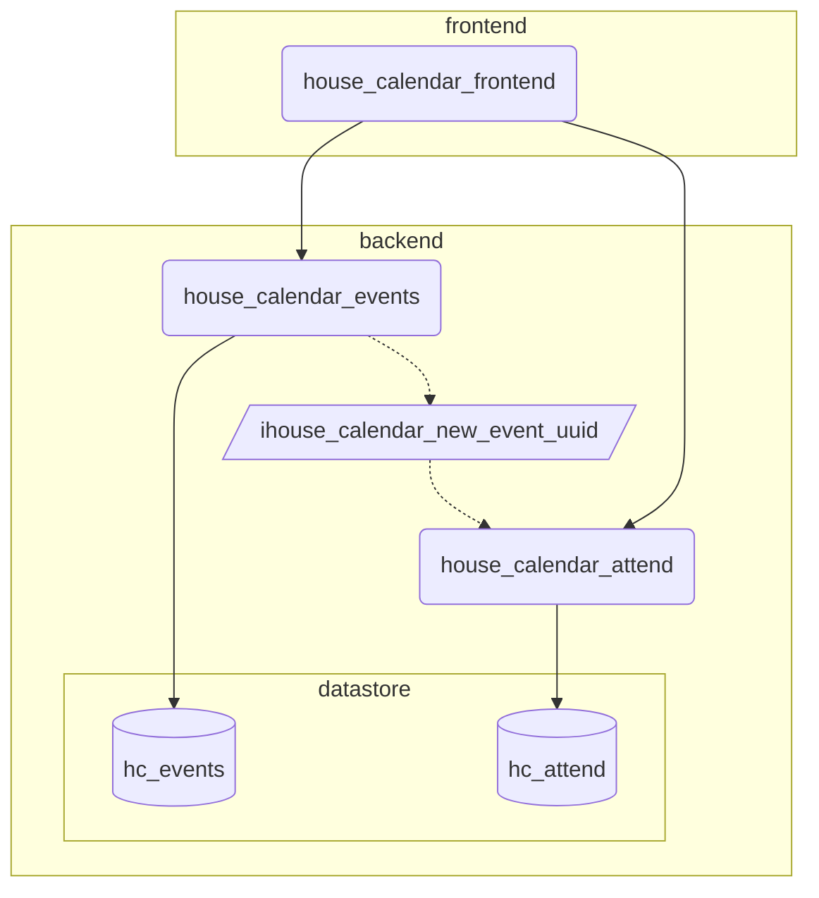

# House Music Calendar Event Service

## Purpose

house_calendar_events is a the microservice to wrap and abstract the event db
postgres database. It handles basic CRUD interaction with Event and Locations.
It is part of a wider House Calendar web application.

There are two python packages that lead to two containers:
- house_calendar_event 
    - A microservice containing wrapping the event database
- house_calendar_event_init
    - Setups and configures the alembic models inside a postgres database

## Endpoints

This micro-service is designed to handle basic CRUD operations of against
events, but also be a good  citizen for kubernetes/docker/podman with health
checks and statuses. When launched locally can be accessed from
`localhost:8000/docs/` for openapi documentation (with tests).

Status & Health Check Endpoints:

| Method  | Endpoint    | Description                        |
|---------|-------------|------------------------------------|
| `GET`   | /pulse/     | Basic binary canary "OK" if good   |
| `GET`   | /status/    | Status response                    |

Event CRUD Endpoints:

| Method  | Endpoint    | Description                        |
|---------|-------------|------------------------------------|
| `GET`   | /event/     | A listing of events                |
| `POST`  | /event/     | Create new event entry             |
| `GET`   | /event/{id} | Get individual event by uuid       |
| `DELETE`| /event/{id} | Delete individual event by uuid    | 

## Project Structure

In this project there are three major root folders:

| Name     | Description                                                        |
|----------|--------------------------------------------------------------------|
| config/  | Setting files used by the Dynaconf to pass setting variables       |
| doc/     | For documentation and supporting templates (such copyright notice) |
| scripts/ | For supporting scripts, such as startup/teardown for local dev env |
| src/     | For all main code related to library/packages of micro-service     |

Inside `src/`, there are few major folders:

| Name                          | Description                                 |
|-------------------------------|---------------------------------------------|
| src/test                      | For tests                                   |
| src/house_calendar_event      | used by the main microservice container     |
| src/house_calendar_event_init | Used by the alembic intialization container |

Inside `src/house_calendar_event` the major folders:

| Name                          | Description                                    |
|-------------------------------|------------------------------------------------|
| ./routers/                    | contains handlers and supporting dao functions |
| ./db/                         | For table model defintions                     |


## Application Infrastructure


## Local Development Environment

For the local development environment there is are two main podman setup and
teardown scripts, `scripts/podmaon-up.sh` and `scripts/podman-dn.sh` which
starts containers that are dependencies fo the main microservices.

### Intialization

To setup the local development environment:
- dependency libaries need to be installed
- A 3.10 python interperter and virtual env needs to be defined

to do this run in terminal:
```bash
make init
```

### Configuration

To be able start local environment, the local dependency setup scripts set the
env to `testing` and few values need to be set in a `config/.secrets.toml`

As an example:
```toml
# inside .secrets.toml
[testing]
postgres_server_credentials="postgres:postgres"
```

After configuration in the terminal call:
```bash
make test
```

To test the code against the service dependencies, run:
```
./scripts/podman-up.sh && poetry run pytest -s
```